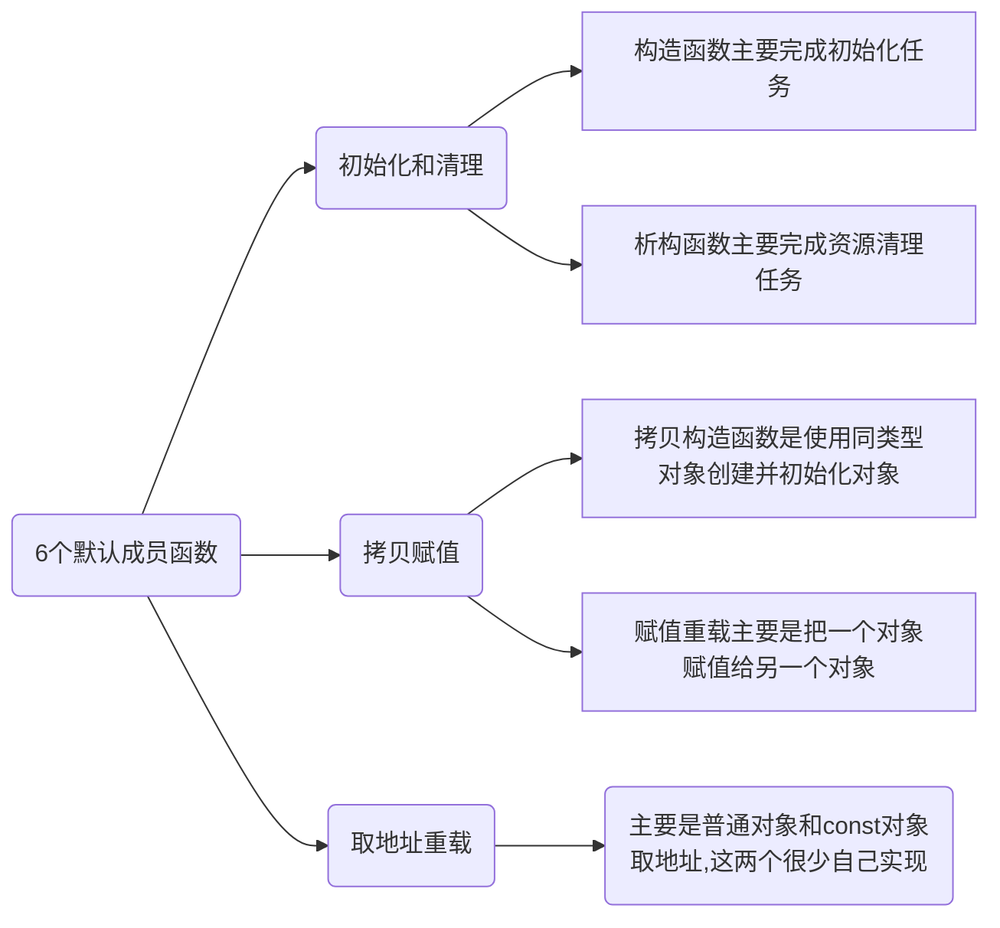

<center>类和对象（二）
</center>

# 一、类的6个默认成员函数

&emsp;&emsp;在C中我们使用一些数据结构时，会经常出现一些问题：忘记调用初始化函数、忘记调用销毁函数（内存泄露），既然这么容易忘记，我们能不能增加一些机制呢？

&emsp;&emsp;C++增加了**默认成员函数的机制**：如果一个类中什么成员都没有，简称为空类。空类中什么都没有吗？并不是的，任何一个类在我们不写的情况下，都会自动生成下面6个默认成员函数。



# 二、构造函数

## 1 概念

&emsp;&emsp;构造函数是一个特殊的成员函数，**名字与类名相同**,**创建类类型对象时由编译器自动调用**，保证每个数据成员都有 一个**合适的初始值**，(比如指针变量先置空而不是什么用不管弄成一个野指针)并且在对象的生命周期内只调用一次。

## 2 特性

&emsp;&emsp;构造函数是特殊的成员函数，需要注意的是，构造函数的虽然名称叫构造，但是需要注意的是构造函数的主要任务并不是开空间创建对象，而是**初始化对象**。 其特征如下： 

1. **函数名与类名相同**。 
2.  **无返回值**。 
3. **对象实例化时编译器自动调用对应的构造函数**。 
4. **构造函数可以重载**。

&emsp;&emsp;我们用一个日期类来讲解实践一下这四条规则。

```cpp
class Date
{
public:
    //无参数的
    Date()
    {
        _year = 2022;
        _month = 1;
        _day = 1;
    }
    //有参数的
    Date(int year, int month, int day)
    {
        _year = year;
        _month = month;
        _day = day;
    }
private:
    int _year;
    int _month;
    int _day;
};
int main()
{
    Date d1;//默认调用无参的
}
```

&emsp;&emsp;我们可以利用缺省参数把无参的构造函数和有参数的构造函数合并到一起，利用全缺省参数即可。

```cpp
class Date
{
public:
    //缺省参数
    Date(int year = 2021, int month = 1, int day = 1)
    {
        _year = year;
        _month = month;
        _day = day;
    }
private:
    int _year;
    int _month;
    int _day;
};
int main()
{
}
```

&emsp;&emsp;这里要注意全缺省参数和无参的构造函数可以构成函数重载，语法上是没有问题的，但是调用时会存在问题，经测试，VS编译器遇到这种情况就会报错告诉我们有多个默认构造函数，如下例。

```cpp
class Date
{
public:
    //无参数的
    Date()
    {
        _year = 2022;
        _month = 1;
        _day = 1;
    }
    //有参数的
    Date(int year = 2023, int month = 1, int day = 1)
    {
        _year = year;
        _month = month;
        _day = day;
    }
private:
    int _year;
    int _month;
    int _day;
};

int main()
{
    Date d1;
    int a = 1;
    cout << a << endl;
}
```


&emsp;&emsp;另外，无参数的构造函数或全缺省参数的构造函数或不写构造函数时系统自动生成的构造函数(也是无参数的，下面会重点讲解)又被称为默认构造函数,总之默认构造函数就是直接写``Date d;``时不加任何参数调用的构造函数。

5. **如果类中没有显式定义构造函数，则C++编译器会自动生成一个无参的默认构造函数，一旦用户显式定义构造函数编译器将不再生成**。

&emsp;&emsp;下面讨论一下编译器自动生成的无参默认构造函数的行为。


&emsp;&emsp;根据图中来看，看起来编译器默认生成的构造函数什么也没干啊？

&emsp;&emsp;不是这样的。

&emsp;&emsp;首先,C++中类型分为内置类型（基本类型）和自定义类型。

&emsp;&emsp;内置类型：比如``int/char/double/指针/数组``等等

&emsp;&emsp;自定义类型：``struct/class``定义的类型。

&emsp;&emsp;C++默认生成的构造函数，**对于内置类型不做处理**，**对于自定义类型**会去**调用它的默认构造函数**，如果没有默认构造函数就会报错。

&emsp;&emsp;这里没有默认构造函数的意思是你写了构造函数，但是不是无参或者全缺省参数的，根据我们上面的特性5，由于你写了构造函数，这样编译器就自动不会生成默认构造函数了,由于我们没有写默认构造函数(无参的或是全缺省的)，**这样相当于不存在默认构造函数**，就会报错。

&emsp;&emsp;什么是默认构造函数呢？默认构造函数是不用参数时默认调用的构造函数，如``Date d;``d调用的构造函数就是默认构造函数。

&emsp;&emsp;任何一个类的默认构造函数可能是以下三种中的一个：**全缺省（自己写的）、无参数的（自己写的）、不写构造函数时编译器默认生成的**，且**默认构造函数是唯一的**，**当你写了构造函数时编译器就不会生成默认构造函数了**，这也可以解释我们的无参构造函数和全缺省构造函数的冲突，因为默认构造函数是唯一的。

&emsp;&emsp;下面先验证一下编译器自动生成的默认构造函数对自定义类型会调用其默认构造函数：

```cpp
class A1
{
    //这里一定要把构造函数写成public，
    //不然A2没有权限调用A1的构造函数 坑了我半天。。。
public:
    A1()
    {
        cout << "A1()" << endl;
    }
};
class A2
{
private:
    int a;
    int b;
    A1 _A1;
};
int main()
{
    A2 a2;
}
```


&emsp;&emsp;再验证一下如果调用的自定义类型没有默认构造函数会报错：


&emsp;&emsp;补上默认构造函数后也可以正常编译运行。


&emsp;&emsp;总的来说，C++我们不写默认构造函数的时候，编译器自动生成的默认构造函数不够函，它对内置类型直接放着不管，可能导致野指针等问题，对自定义类型的处理差强人意，**所以尽量不要不写默认构造函数**。

&emsp;&emsp;我们写默认构造函数的目的是我们在构造对象的时候，不管加不加参数一定要把类的成员变量进行合理的初始化(如指针置空,大小赋0)。

&emsp;&emsp;这里我们要提一下默认构造函数的使用方法。

&emsp;&emsp;构造函数只有两种调用方法：

```cpp
Date d;//调用默认构造函数
Date d1(2022, 1, 3);//调用含参的构造函数
```

&emsp;&emsp;不允许下面的调用方法：

```cpp
Date d();//虽然不会报错，但是不识别，不会实际生成d这个对象
//因为不识别，我怎么知道你写的是函数声明还是调用的构造函数呢
//但是C++编译器对此不报错，极不利于学习。。。
```

提炼出两点：

6. C++默认生成的构造函数，**对于内置类型不做处理**，对于自定义类型会去**调用它的默认无参构造函数**，如果没有默认无参构造函数就会报错。
7. 任何一个类的默认构造函数都有三个：**全缺省（自己写的）、无参数的（自己写的）、不写构造函数时编译器默认生成的**，且**默认构造函数是唯一的**，**当你写了构造函数时编译器就不会生成默认构造函数了**。

# 三、析构函数

## 1 概念

&emsp;&emsp;析构函数：与构造函数功能相反，**析构函数不是完成对象的销毁**，局部对象销毁工作是由编译器利用函数栈帧的创建和销毁完成的。而**对象在销毁时会自动调用析构函数**，**完成该对象的一些资源清理工作**。

## 2 特性

析构函数是特殊的成员函数。 其特征如下： 

1. 析构函数名是在类名前加上字符 ~。 
1. 无参数无返回值。 
1. 一个类有且只有一个析构函数。若未显式定义，系统会自动生成默认的析构函数。 
1. 对象生命周期结束时，C++编译系统系统自动调用析构函数。


&emsp;&emsp;简单验证一下其他规则：

```cpp
class Date
{
public:
    ~Date()
    {
        cout << "~Date()" << endl;
    }
private:
    int _year;
    int _month;
    int _day;
};
int main()
{
    Date d;
}
```


&emsp;&emsp;析构函数也不是什么都不用做，如果对象的资源不能随着栈帧的销毁而释放，如对象持有一个malloc申请的堆一块内存的指针，我们析构函数就要实现回收堆上的内存，把它free掉。

```cpp
class Array
{
public:
    Array(int capacity = 4)
    {
        _a = (int*)malloc(sizeof(int) * capacity);
        _size = 0;
        _capacity = capacity;
    }
    ~Array()
    {
        cout << "~Array()" << endl;
        free(_a);
        _a = nullptr;
        cout << this << endl;
    }
private:
    int* _a;
    int _size;
    int _capacity;
};

int main()
{
    Array s1(4);
    Array s2;
}
```

&emsp;&emsp;并且析构函数调用顺序和构造函数的顺序是反的，创建对象时是按顺序一个一个压栈嘛，销毁对象时就是出栈嘛，如上面的析构函数是先调用s1的再调用s2的，可以通过断点或this指针看到。

5. 关于编译器自动生成的析构函数，对于内置类型成员不做处理，对自定类型成员调用它的析构函数。

&emsp;&emsp;如果我们不写析构函数，编译器自动生成的析构函数和构造函数类似，对于内置类型不做处理，对于自定义类型会去调用它的析构函数。

&emsp;&emsp;不处理内置类型其实是明智的，因为对指针乱free可能出问题，比如文件指针也free吗，不是malloc出来的指针也free吗？（比如我自己实现了申请内存的函数）。

&emsp;&emsp;对自定义类型的，编译器生成的默认析构函数调用该类型的析构函数也是明智的，调用自定义类型的析构函数，帮助我们回收资源。

# 四、拷贝构造函数

## 1 概念

&emsp;&emsp;我们可否用一个对象直接构造一个新的对象呢，比如：

```cpp
Date d1;
Date d2(d1);//
```

&emsp;&emsp;这就引出了拷贝构造函数：

&emsp;&emsp;拷贝构造函数：只有单个形参，该形参是对本类类型对象的引用(一般常用const修饰)，在用已存在的类类型对象创建新对象时由编译器自动调用。

```cpp
class Date
{
public:
    Date(int year = 2022, int month = 1, int day = 1)
    {
        _year = year;
        _month = month;
        _day = day;
    }
    Date(Date& d)
    {
        _year = d._year;
        _month = d._month;
        _day = d._day;
    }
    ~Date()
    {
        cout << "~Date()" << endl;
    }
private:
    int _year;
    int _month;
    int _day;
};
int main()
{
    Date d(2022, 1, 15);
    Date d1(d);
}
```

## 2 特性

&emsp;&emsp;拷贝构造函数也是特殊的成员函数，其特征如下：

1. 拷贝构造函数是构造函数的一个重载形式，**且写了拷贝构造函数后编译器也不会生成无参的默认构造函数了**。


2. 拷贝构造函数的**参数只有一个**且**必须使用引用传参**，**使用传值方式会引发无穷递归调用**。

&emsp;&emsp;原因：调用拷贝构造函数就要先传参，如果用传值传参，**编译器在这次调用拷贝构造函数传参的过程中会调用拷贝构造函数来复制一份对象给参数**，所以为了复制对象又要调用拷贝构造函数，反反复复层层递归下去；

&emsp;&emsp;如果传引用，语法上是起别名，底层是传指针，就不会调用拷贝构造函数，也就不会发生无穷递归了。

&emsp;&emsp;C++中，自定义类型中如果用同一类型来初始化某一对象（如传对象参数）就会调用拷贝构造函数。

&emsp;&emsp;我们可以验证一下自定义类型实例化的对象在函数传参数的时候会调用拷贝构造函数：

```cpp
class Date
{
public:
    Date(int year = 2022, int month = 1, int day = 1)
    {
        _year = year;
        _month = month;
        _day = day;
    }
    Date(Date& d)
    {
        _year = d._year;
        _month = d._month;
        _day = d._day;
    }
    ~Date()
    {
        cout << "~Date()" << endl;
    }
private:
    int _year;
    int _month;
    int _day;
};

void f(Date d)
{
    cout << "f(Date)" << endl;
}

int main()
{
    Date d;
    f(d);
}
```

&emsp;&emsp;第一步：


&emsp;&emsp;第二步：


&emsp;&emsp;第三步：


&emsp;&emsp;另外，建议拷贝构造函数都加``const``,第一层原因，如果我们把顺序写错了，用还没初始化的d2的值给给d1，不就修改了d1的值了嘛，所以加上const可以在编译期间发现这一错误.

```cpp
//Date d2(d1);
Date(Date& d)
{
	d._year = _year;
	//相当于d1._year 被d2._year赋值了
	_month = d._month;
	_day = d._day;
}
```

&emsp;&emsp;在下面加上const:


3. 若未显示定义，系统生成默认的拷贝构造函数。

&emsp;&emsp;默认生成的拷贝构造函数，**对内置类型的成员，会完成按字节序的拷贝**，这是一种**浅拷贝**。

&emsp;&emsp;对内置类型这样就够了吗？不够，如果一个对象1持有一个指向堆上内存的指针，也是内置类型，字节序拷贝得到对象2，持有的指针值和对象1持有的指针值相等，就是同一块地址，对象1调用析构函数先free第一次没问题，对象2调用析构函数时，会对同一个地址free第二次，出错；或者说，对象1已经free掉后，拷贝得来的对象2再解引用指针就会非法访问没有权限的内存，就会发生运行时错误。

&emsp;&emsp;默认生成的拷贝构造函数，**对自定义类型的成员，会调用自定义类型的拷贝构造函数**，这是浅拷贝还是深拷贝取决于自定义类型的拷贝构造函数是什么样的。

&emsp;&emsp;编译器生成的拷贝构造函数的行为和编译器生成的析构函数和构造函数不同。拷贝构造函数会对内置类型浅拷贝，但是构造函数和析构函数都不会对内置类型做任何处理，不过他们对自定义类型的处理是一样的，都会调用自定义类型对应的相应函数（自定义类型的默认构造构造函数、析构函数、拷贝构造函数）。

&emsp;&emsp;我们验证一下默认生成的拷贝构造函数会调用自定义类型的拷贝构造函数：

```cpp
class A
{
public:
    A()
    {
        cout << "A()" << endl;
    }
    A(const A& a)
    {
        cout << "A(const A&)" << endl;
    }
};
class Date
{
public:
    Date()
    {
        cout << "Date()" << endl;
    }
    ~Date()
    {
        cout << "~Date()" << endl;
    }
private:
    int _year;
    int _month;
    int _day;
    //A _aa;
};

int main()
{
    Date d1;
    Date d2(d1);
}
```


&emsp;&emsp;第一步


&emsp;&emsp;第二步：


&emsp;&emsp;看看输出：


4. 局部变量是在离开作用域时声明周期结束，全局变量和静态本地变量在``main``函数结束时生命周期结束析构，生命周期相同时，根据栈帧的规则，先定义的先析构，后定义的后析构。

```cpp
class A
{
public:
	A(int x = 1)
	{
		a = x;
	}
	~A()
	{
		cout << this->a << endl;
	}
private:
	int a;
};
A m(4);
int main()
{
	static A b(2);
	static A c(1);
}
A l(3);
```


&emsp;&emsp;这个例子的结果看起来不符合生命周期相同时先定义的后析构啊，按顺序不是先定义的m，然后定义的b、c然后定义的l吗？

&emsp;&emsp;全局变量和静态本地变量不是都放在静态数据区嘛，为啥静态本地变量先析构，全局变量再析构捏？

&emsp;&emsp;实际上，程序调用时，操作系统先进入的不是``main``,而是更外层的一些加载器，然后会进全局把这些全局变量放到静态区``l、m``，然后才进入``main``函数，把``b、c``放进静态区，所以从顺序上来说，析构顺序是``c b m l``也是符合先定义的对象后析构这一原则的，因为静态本地变量是在之后进入``main``函数才定义的，所以它们先析构，然后析构全局变量。


# 五、运算符重载简介

&emsp;&emsp;C++提供了运算符重载，使得我们的自定义类型能够像内置类型一样使用运算符，如``+,=,-,++,--,==,!=...``，试想以下场景：

```cpp
class Date
{
public:
	Date(int year = 2022, int month = 1, int day = 1)
	{
		_year = year;
		_month = month;
		_day = day;
	}
private:
	int _year;
	int _month;
	int _day;
};

int main()
{
    Date d1(2022, 1, 16);
    Date d2(2022, 1, 31);
    bool f = d2 > d1;//比较日期哪个大？
    int day = d2 - d1;//看看两个日期相差多少天
}
```

&emsp;&emsp;默认情况下，C++对自定义类型是不允许使用运算符的：


&emsp;&emsp;C++为了增强代码的可读性引入了运算符重载，运算符重载是具有特殊函数名的函数，也具有其返回值类型，函数名字以及参数列表，其返回值类型与参数列表与普通的函数类似。

&emsp;&emsp;函数名字为：关键字``operator``后面接需要重载的运算符符号。

&emsp;&emsp;函数原型：返回值类型 ``operator``操作符(参数列表)，返回类型根据我们的设计来设计类型。

&emsp;&emsp;这个操作符有几个操作数，参数列表就有几个参数，如下面一个``Date``的大小比较函数。

```cpp
bool operator>(const Date& d1, const Date& d2);
//d1是左操作数
//d2是右操作数
```

```cpp
bool operator>(const Date& d1, const Date& d2)
{
	if (d1._year > d2._year)
	{
		return true;
	}
	else if (d1._year == d2._year && d1._month > d2._month)
	{
		return true;
	}
	else if (d1._year == d2._year && d1._month == d2._month && d1._day > d2._day)
	{
		return true;
	}
	return false;
}
```

&emsp;&emsp;这里有一个问题，``private``限定符``_year``等成员是不允许给类外成员访问的，可以提供一些什么``public``的``getyear()``之类的函数，完全不破坏封装性，但是比较麻烦，所以我们这里可以先把``private``限定符去掉,

&emsp;&emsp;对于重载的操作符函数，我们有两种运算方式：

```cpp
cout << (d1 > d2) << endl;//<<运算符的优先级大于>
cout << operator>(d1, d2) << endl;
//操作符函数就是一个函数嘛 虽然函数名怪怪的但是当然也可以调用了
```

&emsp;&emsp;原理，编译器遇到``d1>d2``，先去寻找你有没有提供``>operator``重载函数，如果没有就会报错，如下：


&emsp;&emsp;如果提供了操作符重载函数，就会把``d1 > d2``替换成``operator>(d1, d2)``。

&emsp;&emsp;为我们提供了``>``这种用法提高了程序的可读性。

注意：

- **不能**通过连接其他符号来**创建新的操作符**：比如operator@ ；
- 重载操作符必须有一个类类型或者枚举类型的操作数；
- **用于内置类型的操作符**，其含义不能改变，例如：内置的整型+，**不能改变其含义**；
- **作为类成员的操作符重载函数**，其形参看起来比操作数数目少1成员函数的操作符有一个默认的形参this，限定为第一个形参;
- ``.*(很少有人用) 、::(作用域解析符) 、sizeof 、? :(唯一的三目运算符) 、.(点，类成员作用符) ``注意以上5个运算符不能重载。这个经常在笔试选择题中出现，注意``*``是可以重载的，比如迭代器解引用，但``.*``是不可以重载的，很容易混。

&emsp;&emsp;根据第三条，我们可以再提供一种方式，不修改``private``访问限定符就能实现``opeartor>``:

&emsp;&emsp;我们先直接放到类里面，看看会发生什么：


&emsp;&emsp;编译器认为我们的参数太多了？！回想``this``指针的知识，你把函数放到类里面，会变成成员函数，成员函数会有隐藏的``this``指针！

```cpp
d1 > d2;
//处理成
d1.operator>(&d1, d2);
//d1传给了this d1传给了d2
```

&emsp;&emsp;我们修改一下，把它放到类里面并且修改一下参数：

```cpp
class Date
{
public:
	Date(int year = 2022, int month = 1, int day = 1)
	{
		_year = year;
		_month = month;
		_day = day;
	}
	bool operator>(const Date& d2)
	{
		if (this->_year > d2._year)
		{
			return true;
		}
		else if (this->_year == d2._year && this->_month > d2._month)
		{
			return true;
		}
		else if (this->_year == d2._year && this->_month == d2._month && this->_day > d2._day)
		{
			return true;
		}
		return false;
	}
private:
	int _year;
	int _month;
	int _day;
};
```

&emsp;&emsp;就没有报错了。

&emsp;&emsp;调用过程是编译器优先去类的成员去找，成员找不到则去全局找（这个和编译器的实现有关，至少VS是这样）。

```cpp
class Date
{
public:
	Date(int year = 2022, int month = 1, int day = 1)
	{
		_year = year;
		_month = month;
		_day = day;
	}
	bool operator>(const Date& d2)
	{
        cout << "类内！" << endl;
		if (this->_year > d2._year)
		{
			return true;
		}
		else if (this->_year == d2._year && this->_month > d2._month)
		{
			return true;
		}
		else if (this->_year == d2._year && this->_month == d2._month && this->_day > d2._day)
		{
			return true;
		}
		return false;
	}
private:
	int _year;
	int _month;
	int _day;
};

bool operator>(const Date& d1, const Date& d2)
{
	cout << "全局！" << endl;
}
```


&emsp;&emsp;Linux的g++编译器也是这样的，测试如下：


# 六、赋值运算符重载

## 1 概念与书写

&emsp;&emsp;拷贝构造函数是用一个已经存在的对象拷贝初始化另一个马上要实例化的对象，如:

```cpp
Date d1;
Date d2(d1);
```

&emsp;&emsp;赋值运算符重载，我们希望做到两个已经存在的对象之间相互赋值拷贝。

```cpp
Date d1;
Date d2;
d2 = d1;
```

&emsp;&emsp;仿照上面的运算符重载，我们先在类里面自己实现一个赋值运算符重载：

```cpp
class Date
{
    //....
	void operator=(const Date& d)
	{
		_year = d._year;
		_month = d._month;
		_day = d._day;
	}
    //..
};
```

&emsp;&emsp;但是这样写有些问题，赋值运算符是支持连续赋值的，比如

```cpp
int i, j , k, l;
i = j = k = l = 1;
//1赋值给l 返回值是l l赋值给k 返回值k k赋值给j 返回值j j赋值给i 返回值没人用
```


&emsp;&emsp;使用this指针修改一下我们的``operator=``；

```cpp
class Date
{
    //....
	Date operator=(const Date& d)
	{
		_year = d._year;
		_month = d._month;
		_day = d._day;
        return *this;//this是左操作数的地址
        //*this得到左操作数
	}
    //..
};
```

&emsp;&emsp;但是传值返回的过程会有一次拷贝，验证如下：


&emsp;&emsp;思考一下能否返回引用:关键是看离开了赋值重载函数``operator=``后，this指向的对象生命周期是否结束。

&emsp;&emsp;因为离开了赋值重载函数后，左操作数还在，生命周期没有结束，如``d2 = d1 = d0;``,``d0``赋值给``d1``返回给``d1``，离开``operator=``,``d1``当然还在呀，所以可以返回引用！

&emsp;&emsp;因为赋值运算符重载是对两个已经存在的对象进行赋值，所以离开``operator=``函数后，对象的生命周期不会结束，所以可以返回引用以提高效率。

修改如下：

```cpp
class Date
{
    //....
	Date& operator=(const Date& d)
	{
		_year = d._year;
		_month = d._month;
		_day = d._day;
        return *this;//this是左操作数的地址
        //*this得到左操作数
	}
    //..
};
```

&emsp;&emsp;思考，赋值运算符重载还可以有一点小优化，有时候会写错，自己给自己赋值，比如``d1 = d1;``,虽然不会出错，但是再拷贝一遍没什么卵用，所以我们可以利用``this``指针让这种情况避开：

```cpp
class Date
{
    //....
	Date& operator=(const Date& d)
	{
        if (this != &d)
        {
			_year = d._year;
			_month = d._month;
			_day = d._day;	
        }
        return *this;//this是左操作数的地址
        //*this得到左操作数
	}
    //..
};
```

## 2 特性

&emsp;&emsp;一个类如果没有显式定义赋值运算符重载，编译器也会自动生成一个，对于内置类型成员变量，会完成字节序值拷贝；对于自定义成员变量，会调用它的``operator=``，也就是说，它干的事情和拷贝构造函数类似。

&emsp;&emsp;所以是否自己写赋值运算符重载对内置类型，看是否只需要完成浅拷贝，浅拷贝可以不写，深拷贝需要自己写，如果是自定义类型那么不需要自己写，只要自定义类型的赋值运算符重载写的够了就行。

```cpp
//两个已经存在的对象之间赋值会调用赋值重载函数
//用一个已经存在的对象初始化创建一个尚未存在的对象是拷贝构造
Date d2(d1);//拷贝构造
Date d2 = d1;//拷贝构造
```

# 七、日期类的实现

&emsp;&emsp;有了这些知识，我们可以实现一个日期类了，日期类提供以下下功能：

```cpp
class Date
{
public:
	//默认构造函数
	Date(int year = 2022, int month = 1, int day = 1);
    
	//拷贝构造函数
    Date(const Date& d);
    
    //析构函数
    ~Date();
    
    //打印具体年月日
	void Print();
    
    //由于存在闰年的问题，我们要专门设计一个函数来获得某年某月的日期数
	int Getmonthdays(int year, int month);
    
    //比较两个日期的的大于号
	bool operator>(const Date& d);
    
    //比较两个日期的大于等于号
	bool operator>=(const Date& d);
    
    //比较两个日期的小于号
	bool operator<(const Date& d);
    
    //比较两个日期的小于等于号
	bool operator<=(const Date& d);
    
    //赋值运算符重载
	Date& operator=(const Date& d);
    
    //判断两个日期是否相等的运算符重载函数
	bool operator==(const Date& d);
    
    //重载!=运算符，判断两个日期是否不相等
	bool operator!=(const Date& d);
	
    //两个日期相加没有意义
    //日期加天数才有意义
	Date operator+(int days);
    
    //重载日期加天数+=运算符
	Date& operator+=(int days);
    
    //日期减天数的运算符
	Date operator-(int days);
    
    //重载日期减天数-=运算符
	Date& operator-=(int days);

    //前置++
	Date& operator++();

    //后置++
	Date operator++(int);
    
    //前置--
    Date& operator--();
    
    //后置--
	Date operator--(int);
    
    //日期减日期返回天数
    int operator-(const Date&);
	
private:
	int _year;
	int _month;
	int _day;
};
```

&emsp;&emsp;让我们分成7类来实现：

## 1 打印函数

&emsp;&emsp;这个属于是有手就行了，实现如下：

```cpp
void Date::Print()
{
	cout << _year << "年" << _month << "月" << _day << "日" << endl;
}
```


## 2 默认构造函数、拷贝构造函数实现

&emsp;&emsp;我们用一个全缺省参数的构造函数作为默认构造函数，覆盖掉编译器自动生成的默认构造函数，因为编译器自动生成的默认构造函数不会对内置类型做任何赋值处理，所以我们覆盖掉：

```cpp
Date::Date(int year, int month, int day)
{
    _year = year;
    _month = month;
    _day = day;
}
```

&emsp;&emsp;这样就够了吗？OOP中有一句话，永远不能相信用户，万一用户输入的日期是违法的呢，而且考虑到闰年的判断并不简单，比如输入

```cpp
Date d1(2000, 2, 29);
Date d2(2022, 2, 29);
```

&emsp;&emsp;这两个日期是否合法其实判断是比较麻烦的是一个事情，所以我们可以先实现一个对于指定年的指定月返回当月天数的方法``Getmonthdays``：

```cpp
int Getmonthdays(int year, int month)
{
    static int days[13] = { 0, 31, 28, 31, 30, 31, 30, 31, 31, 30, 31, 30, 31 };
    //非闰年的情况下，每个月的天数是固定的，不需要每轮进来都重新生成数组
    //直接声明成静态本地变量就好 这样除了第一次进来会创建
    //其他时候进来就不会创建
    int ret = days[month];
    //只有2月才有闰年和非闰年的区别
    if (month == 2)
    {
        //闰年的判断
        if ((year % 4 == 0 && year % 100 == 0) || year % 400 == 0)
        {
            ret++;
        }
    }
    return ret;
}
```

&emsp;&emsp;然后可以控制日期是否合法,实现如下：

```cpp
Date::Date(int year, int month, int day)
{
	_year = year;
	_month = month;
	_day = day;
    //什么情况是非法呢？
    //如果日期不正常就算非法
    //什么叫正常日期呢？
    //年数大于等于0，月数大于等于1小于等于12
    //天数大于0小于当年当月日期数Getmonthdays()
	if (!(_year >= 0
		&& (_month > 0 && _month < 13) &&
		(_day > 0 && _day <= Getmonthdays(_year, _month))))
	{
		cout << "非法日期->";
		Print();//打印一下日期
	}
}
```

&emsp;&emsp;考虑一下编译器自动生成的拷贝构造函数，它的行为是会按字节序拷贝内置类型，调用自定义类型的拷贝构造函数，其实编译器生成的我们就够用了，但是为了练手还是实现一下：

```cpp
Date::Date(const Date& d)
{
    _year = d._year;
    _month = d._month;
    _day = d._day;
}
```

## 3 重载日期比较运算符

&emsp;&emsp;前面已经实现过了``operator>``的重载，我们加上注释重新提供一份：

```cpp
bool Date::operator>(const Date& d)
{
	//如果年数大于右操作数d的对应年数，返回true
	if (_year > d._year) {
		return true;
	}
	//否则如果年数相同左操作数的月数_month，返回true
	else if (_year == d._year && _month > d._month) {
		return true;
	}
	//否则如果年数月数都相同但是左操作数的天数_day大于有操作数的天数，返回true
	else if (_year == d._year && _month == d._month && _day > d._day) {
		return true;
	}
	else//年数大于的情况都罗列完了 其他情况都返回false就可以了
	{
		return false;
	}
}
```

&emsp;&emsp;其他的比较运算符都可以类似实现，实现如下：

``operator==``:天数和月数和年数都相等是真！

```cpp
bool Date::operator==(const Date& d)
{
	return (_day == d._day) && (_month == d._month) && (_year == d._year);
}
```

&emsp;&emsp;只要比较运算符的含义是和正常实数的序关系一样的，即大于互斥事件是小于等于等等，那么只要实现一个大于和一个==就能复用实现其他的运算符。

``operator>=``:大于等于逻辑上等价于大于或等于，对大于和判等取或。

```cpp
bool Date::operator>=(const Date& d)
{
	//大于等于的实现就等于大于或等于！
	return (*this > d) || (*this == d);
}
```

``operator<``:小于等价于不大于等于，对大于等于的真假性取反。

```cpp
bool Date::operator<(const Date& d)
{
	return !(*this >= d);
}
```

``operator<=``:小于等于等价于不大于，对大于的真假性取反。

```cpp
bool Date::operator<=(const Date& d)
{
	return !(*this > d);
}
```

``operator!=``:不等于号等价于判等号取反。

```cpp
bool Date::operator!=(const Date& d)
{
	return !(*this == d);
}
```

## 4 赋值运算符重载

&emsp;&emsp;其实编译器自动生成的赋值操作符重载就够了，对内置类型会完成字节序的拷贝嘛，但是我们为了练手还是实现一下：

```cpp
Date& Date::operator=(const Date& d)
{
	if (this != &d)//如果不重复，才有必要拷贝
	{
		_year = d._year;
		_month = d._month;
		_day = d._day;
	}
    //赋值运算符重载的左操作数和有操作数都是已经实例化的对象了
    //它们生命周期随着离开这个函数而结束
    //所以可以返回引用 提高效率
	return *this;
}
```

## 5 日期运算操作符重载

&emsp;&emsp;根据我们的常识，日期之间相互加减是没有意义的，但是日期加天数是有意义的，我们先实现``operator+=``.

&emsp;&emsp;思考+=运算符，存在这种场景``i = j + ( k += 1);``,从这点看它的返回值是**增加天数后的日期**。

```cpp
Date& Date::operator+=(int days)
{
    _day += days;
    while (_day > Getmonthdays(_year, _month))
    {
        //先让日期减去当月的天数
        _day -= Getmonthdays(_year, _month);
        //然后month++
        _month++;
        if (_month == 13)
        {
            //如果_month到了13了 就该向下一年进位了
            _year++;
            _month = 1;//月份重新置为1月
        }
    }
    //因为离开了这个函数实例化的对象仍然在，所以返回引用
    return *this;
}
```

&emsp;&emsp;有了``+=``接下来``+``也可以复用的实现了，思考，``int i = k + j + l + n;``这种情况时，``k + l``先运算，它的返回值也是一个``int``类型，并且``k``和``l``都不会变。所以对于我们的日期类，返回值应该是日期这个类，至于是否是引用，要看离开了函数后，返回值的生命周期是否结束。

```cpp
Date Date::operator+(int days)
{
    //因为相加不会改变任何一个操作数 结果只体现在返回值
    //所以不能修改this指针，我们拷贝this指针解引用的对象
    //然后复用+=运算再返回
    Date ret(*this);
    ret += days;
    //这个ret是我们在这个函数里创建的局部变量，离开这个函数生命周期就结束了
    //所以我们不能返回引用 要返回值 让接收方去拷贝
    return ret;
}
```

&emsp;&emsp;同理，先实现``-=``,这里用了些技巧，注意我们的注释。

```cpp
Date& Date::operator-=(int days)
{
	_day -= days;
	while (_day <= 0)
	{
		//如果这里已经是1月了 _month - 1等于0,但是不会出问题
		//因为我们前面定义了days[0]等于0 所以0月相当于什么都不敢
		//然后1--变成0 然后置成13
		//下一轮_month - 1就等于12 会正常调用12的31天就可以优秀的解决跨年的问题了
		_day += Getmonthdays(_year, _month - 1);
        //日期不合法 则借前一个月的天数，这是因为本月的天数已经借完了
		_month--;
		if (_month == 0)
		{
			//1月减到了0月其实是减到了12月
			//但是这里利用了上面是_month - 1
			//所以_month要置成13
			_month = 13;
			_year--;
		}
	}
	return *this;
}
```

&emsp;&emsp;这种写法不太健康，用了一个更复杂的逻辑实现这个功能，

&emsp;&emsp;其实就是日期不合法时要+上个月的天数，所以我们应该先月份--得到上个月，考虑跨年问题，然后如果月份到0了，年数-1，把月份弄到12月，然后再加这个月的天数。

```cpp
Date& Date::operator-=(int days)
{
    _day -= days;
    while (_day <= 0)
    {
        _month--;
        if (_month == 0)
        {
            _month = 12;
            --_year;
        }
        _day += Getmonthdays(_year, _month);
    }
    return *this;
}
```

&emsp;&emsp;通过复用实现``operator-``:

```cpp
Date Date::operator-(int days)
{
	Date ret(*this);
	ret -= days;
	return ret;
}
```

&emsp;&emsp;接下来考虑一个问题，如果我们的类用户给``+``后面的右操作数是``-3``这样的负数，给``-``操作符后面的右操作数也是负数呢？本着绝不相信用户的原则，我们可以通过``+(-1)``等价于``-1``,``-(-1)``等价于``+1``来实现。

&emsp;&emsp;由于我们的``+ - ``是复用``+= -=``,所以修改``+= -=``即可，``+ - ``会通过``+= -=``自动修改。

```cpp
Date& Date::operator+=(int days)
{
	if (days < 0)
	{
		return (*this) -= (-days);
	}
	_day += days;
	while (_day > Getmonthdays(_year, _month))
	{
		_day -= Getmonthdays(_year, _month);
		_month++;
		if (_month == 13)
		{
			//年进位
			_month = 1;
			_year++;
		}
	}
	return *this;
}

Date& Date::operator-=(int days)
{
	if (days < 0)
	{
		return (*this) += (-days);
	}
	_day -= days;
    while (_day <= 0)
    {
        _month--;
        //如果月份到0了，那么要向年借位了
        if (_month == 0)
        {
            _month = 12;
            --_year;
        }
        _day += Getmonthdays(_year, _month);
    }
    return *this;
}
```

&emsp;&emsp;更多的测试用例：上网搜一个日期计算器以和我们的测试相比对，

```cpp
void TestDate2()
{
	Date d1(2022, 1, 16);
	//正常测试
	Date m = d1 - 10;
	//跨年
	Date n = d1 - 16;
	m.Print();
	n.Print();
	//稍微大点数
	Date d2 = d1 + (-100);
	Date d3 = d1 - (-100);
	d2.Print();
	d3.Print();
	cout << d3 - d1 << endl;
	cout << d2 - d1 << endl;
	//跨闰年
	Date d4 = d1 - (-1500);
	Date d5 = d1 + (-1500);
	d4.Print();
	d5.Print();
}
```


&emsp;&emsp;通过了全部测试用例！


## 6 日期递增递减运算符重载与占位参数

&emsp;&emsp;首先考虑一个问题，前置++和后置++都只有一个操作数，这意味着前置++和后置++的形参列表都是一样的，那么我们在重载的时候编译器怎么知道我们在重载的是前置++还是后置++呢？

&emsp;&emsp;这里我们引入一个叫做占位参数的概念，这两个函数的声明分别如下：

```cpp
Date& Date::operator++();//前置++
Date Date::operator++(int);//后置++
```

&emsp;&emsp;这个是怎么一个道理呢？首先，如果没有占位参数，这两个函数形参列表完全相同，不能构成重载，所以``C++``规定我们在写后置++的时候需要加上一个``int``参数，它不起任何作用，仅仅是使得前置++和后置++构成函数重载，让编译器和我们都能够识别而已，由于我们也不会用到这个传的``int``值，所以不用写上变量名。

&emsp;&emsp;在我们调用``d1++;``的时候，编译器会把这句话解析为``d1.operator++(&d1, 0);``,也就是说，会默认传一个0给这个占位参数，这个0没有任何作用，但是这个占位参数使得前置++和后置++构成了函数重载。

&emsp;&emsp;先实现前置++``operator++()``，它可以调用``+=``来实现，返回的是++后的对象，所以可以返回引用。

```cpp
Date& Date::operator++()
{
	(*this) += 1;
	return *this;//返回引用 底层是返回指针 就只拷贝了一个指针变量 速度快得很
}
```

&emsp;&emsp;再实现后置++``operator(int)``,它则需要先保存++前的对象，然后对``this``指针指向的对象做``+= 1``,然后返回刚才保存的对象，由于保存的对象是生命周期只在这个函数里的局部变量，所以返回对象而非对象的引用，在返回时会调用拷贝构造函数拷贝一份带回去。

```cpp
Date Date::operator(int)
{
    Date ret(*this);
    (*this) += 1;
    return ret;
}
```

&emsp;&emsp;同理，可以实现前置--和后置--

``operator--()``:

```cpp
Date& Date::operator--()
{
	return (*this) -= 1;
}
```

``operator--(int)``:

```cpp
Date Date::operator--(int)
{
	Date ret(*this);
	(*this) -= 1;
	return ret;
}
```

&emsp;&emsp;第一种思路，我们先把每个时间都弄成天数+对应年的1月0日，然后比较年差，普通年就是365天，闰年就是366天，然后天数差和年数导致的天数差求和就可以了。

```cpp
int Date::operator-(const Date& d)
{
    Date bigdate = *this;
	Date smalldate = d;
	int flag = 1;
	if (bigdate < smalldate)
	{
		bigdate = d;
		smalldate = *this;
		flag = -1;
	}
    int bigdays = bigdate._day;
    while (bigdate._month != 1)
    {
        --bigdate._month;
        bigdays += Getmonthdays(bigdate._year, bigdate._month);
    }
    int smalldays = smalldate._day;
    while (smalldate._month != 1)
    {
        --smalldate._month;
        smalldays += Getmonthdays(smalldate._year, smalldate._month);
    }
    int curyear = smalldate._year;
    int yeargap = 0;
    while (curyear != bigdate._year)
    {
        if ((curyear % 4 == 0 && curyear % 100 != 0) || curyear % 400 == 0)
        {
            yeargap += 366;
        }
        else
        {
            yeargap += 365;
        }
        curyear++;
    }
    int daygap = bigdays - smalldays;
    return flag * (daygap + yeargap);
}
```

测试用例：

```cpp
void TestDate2()
{
	Date d1(2022, 1, 16);
	//正常测试
	Date m = d1 - 10;
	//跨年
	Date n = d1 - 16;
	m.Print();
	n.Print();
	//稍微大点数
	Date d2 = d1 + (-100);
	Date d3 = d1 - (-100);
	d2.Print();
	d3.Print();
	cout << d3 - d1 << endl;
	cout << d2 - d1 << endl;
	//跨闰年
	Date d4 = d1 - (-1500);
	Date d5 = d1 + (-1500);
	d4.Print();
	d5.Print();
	cout << d4 - d5 << endl;
}
```


&emsp;&emsp;上面的思路是有点麻烦了，我们还可以换一种实现方法：对于日期相减返回天数，我们可以利用++运算符实现：

```cpp
int Date::operator-(const Date& d)
{
	Date bigdate = *this;
	Date smalldate = d;
	int flag = 1;
	if (bigdate < smalldate)
	{
		bigdate = d;
		smalldate = *this;
		flag = -1;
	}
	int ret = 0;
	while (smalldate < bigdate)
	{
		++smalldate;
		++ret;
	}
	return flag * ret;
}
```

&emsp;&emsp;测试用例：


&emsp;&emsp;可以看到对``TestDate2``,两个函数的运算结果是一样的，再测一组：

```cpp
void TestDate4()
{
	Date d1(2022, 1, 17);
	Date d2(2022, 12, 31);
	Date d3(2020, 1, 17);
    //跨月
	cout << d2 - d1 << endl;
    //跨闰年2020年
	cout << d3 - d1 << endl;
}
```


## 7 析构函数

&emsp;&emsp;回想系统默认生成的析构函数，它对内置类型不做任何处理，对自定义类型调用它们的析构函数，我们的日期类全部都是自定义类型，且没有任何非栈帧的资源，其实系统默认生成的析构函数就够用了，不过出于练手，我们写一个吧。

```cpp
Date::~Date()
{
	cout << "~Date()" << endl;
}
```

## 8 打印天数是星期几

&emsp;&emsp;人类的第一个星期一是1900年1月1日，我们可以复用上面的日期减法，得到日期差，然后%7就可以得到对应星期几了，注意星期几和1900年1月1日都是不论那次进来都不变的常量，声明为``static const``即可。

```cpp
void Date::PrintWeekday()
{
	static const char* str[] = { "星期一", "星期二", "星期三", "星期四", "星期五", "星期六", "星期天"};
	static const Date start(1900, 1, 1);
	int gap = (*this) - start;
	cout << str[gap % 7] << endl;
}
```


# 八、坑

&emsp;&emsp;先介绍一下匿名对象。

```cpp
int main()
{
    A();//匿名对象 生命周期只在这一行
}
//应用场景
Date(2022,1,17).PrintWeekday();
//我就想打印一下今天是星期几
```

&emsp;&emsp;不引入右值讨论的情况下，函数的返回值是一个临时对象，它和匿名对象类似，它的生命周期只在这一行，离开这一行会销毁调用析构函数。

&emsp;&emsp;考虑一个题：

```cpp
//以下代码共调用多少次拷贝构造函数
Widget f(Widget u)
{  
    Widget v(u);
    Widget w=v;
    return w;
}

int main()
{
    Widget x;
    Widget y=f(f(x));
}
```

&emsp;&emsp;我们有了上面临时对象的知识，我们来分析一下这个题:

- x传参，传的是对象，调用一次拷贝构造函数生成u，相当于``Widget u(x);``
- 调用了拷贝构造函数生成了对象v;
- 利用v创建并初始化对象w，调用了拷贝构造函数；
- 返回w，调用一个拷贝构造函数生成要返回的临时对象，这里就是f(x);
- f(x)传参数，调用拷贝构造函数生成u；
- 调用了拷贝构造函数生成了对象v;
- 利用v创建并初始化对象w，调用了拷贝构造函数；
- 返回w，调用拷贝构造函数生成要返回的临时对象，这里就是f(f(x));
- 利用临时对象创建y，调用拷贝构造函数；

&emsp;&emsp;这应该是9次才对啊，然而VS实际运行起来却只有7次：

```cpp
//测试代码 利用计数器测试
int cnt = 0;
class Widget
{
public:
    Widget()
    {

    }
    Widget(const Widget&)
    {
        ++cnt;
    }
};

Widget f(Widget u)
{
    Widget v(u);
    Widget w = v;
    return w;
}

int main()
{
    Widget x;
    Widget y = f(f(x));
    cout << cnt << endl;
}
```


&emsp;&emsp;这其实是因为编译器的优化。

&emsp;&emsp;连续的拷贝构造过程会被编译器优化，比如下面这段代码：

```cpp
class A
{
public:
	A()
    {
        cout << "A()" << endl;
    }
    A(const A& a)
    {
        cout << "A(const A&)" << endl;
    }
    ~A()
    {
        cout << "~A()" << endl;
    }
};
A f(A a)
{
    return a;
}
int main()
{
    A x;
    A y = f(x);
}
```

&emsp;&emsp;传值一次，返回值的临时对象拷贝一次，然后拿这个临时对象拷贝构造y，这样应该是3次,但是我们在VS中测试却是两次，why？


&emsp;&emsp;原因如下：

&emsp;&emsp;这个临时对象拷贝完y就销毁了，没有其他作用，所以编译器会做优化，把生成临时对象调用的这次拷贝构造函数和用临时对象拷贝创建y的拷贝构造函数的调用合并起来。

&emsp;&emsp;即不生成临时对象了，直接用函数中的a对象拷贝构造y，所以拷贝构造函数调用的次数被优化成了2次。

&emsp;&emsp;不过这是连续的拷贝构造函数调用，如果我们不是连续的拷贝构造的话，编译器就不会优化了，比如下面这个粒子

```cpp
int main()
{
    A x;
    A y;
    y = f(x);
}
```

&emsp;&emsp;传参调用一次拷贝构造函数，返回创建临时对象，再调用一次拷贝构造函数，不会被优化。


&emsp;&emsp;C++标准并不会强制规定是否要优化，不过现代的大部分编译器都已经有了优化了。

&emsp;&emsp;所以我们回来看本来的题,在VS下测试：


&emsp;&emsp;但真的是临时对象创建的拷贝吗？我们只要看下面那一步需不需要传参就能确定临时对象有没有生成了，因为临时对象如果生成了，它一定是在``main``函数栈帧里的，就需要传参给f，就要再调用拷贝构造函数。


&emsp;&emsp;是不是临时对象``f(f(x))``的生成调用的拷贝构造函数只要看下面``y``的创建还需不需要拷贝构造函数调用即可，如果需要说明这一步是临时对象创建，否则说明这一步是在拷贝构造y，毕竟临时对象``f(f(x))``离开了这一行就没了，所以编译器让临时对象的创建调用的拷贝构造函数和接下来y的创建调用的拷贝构造函数合并了！


&emsp;&emsp;临时对象先构造，再拷贝构造传参，反正你匿名对象生命周期离开这行就销毁了，所以编译器会把临时对象的构造和传参的拷贝构造合并到一起，只调用1次构造。

&emsp;&emsp;总结一下，函数返回生成临时对象调用拷贝构造函数，如果下一步这个临时对象又做为参数调用拷贝构造函数，这两步连续调用会被编译器优化，直接不生成临时对象，直接给最终要生成的那个东西拷贝构造，在第二次``f``函数传参中是那个``u``的构造,在第二次函数返回时是那个``y``的构造。

&emsp;&emsp;用一个图来表示这个过程：


&emsp;&emsp;匿名对象传参也可能会有这种效果，测试如下：

```cpp
Widget f(Widget u)
{
    Widget v(u);
    Widget w = v;
    return w;
}

int main()
{
    Widget x;
    f(Widget(x));
    cout << cnt << endl;
}
```

&emsp;&emsp;本来应该拷贝构造匿名对象->传参->v->w->返回生成匿名对象``f(Widget(x))``;应该是五次，但是却是4次。


&emsp;&emsp;release版本优化太多，我的水平看不懂，就不看了。

# 九、const成员函数

&emsp;&emsp;考虑以下代码报错的原因：

```cpp
const Date d;
d.Print();
```


&emsp;&emsp;是因为d是``const``对象，它的地址的类型是``const Date*``,但是this指针的类型是``Date* const``,

&emsp;&emsp;注意，这里不是``this``指的东西的内容不能改，是``this``的值不能改，即this指向那个对象这个事实不能改变，这样不就你``this``指针可以改我``const``对象了嘛，所以C++引入了``const``成员函数:

```cpp
void Date::Print() const;
```

&emsp;&emsp;加上了``const``的含义就是隐式的将this的类型改为``const Date* const``,这样就能保证``*this``不被改变。

&emsp;&emsp;建议所有不修改成员变量的成员函数都加上``const``,这样``const``对象传参是权限的不变，普通对象的传参是权限的缩小，是不会报错的，并且还保护了不要写错了导致成员变量被修改。

# 十、取地址运算符``&``和``const``取地址运算符&重载

&emsp;&emsp;这两个默认成员函数默认生成的就很好了，一般不需要我们自己重载。

&emsp;&emsp;C++编译器默认实现的&运算符和``const``对象的取地址操作符，都会返回``this``指针的值，作用大概如下代码：

```cpp
class A
{
public:
    //....
    A* operator&()const
    {
        return this;
    }
    const A* operator&() const
    {
        return this;
    }
};
```

&emsp;&emsp;我能想到的用法就是在我有些类对象不想给你看我的地址，我重载这个取地址运算符``&``,使其返回空指针。

```cpp
class A
{
public:
    //...
    A* operator&()const
    {
        return nullptr;
    }
    const A* operator&() const
    {
        return nullptr;
    }
};
```

# 十一、重载<<、>>操作符和友元函数

&emsp;&emsp;我们一拍脑袋，直接写以下``operator<<``,

&emsp;&emsp;这里，我们的``cout``是一个定义在``<iostream>``中的``ostream``类的静态对象，静态对象不会离开这个函数声明周期就结束，所以我们可以返回引用表示这个运算符运算结束后仍然可以接着进行输出插入，实现``cout << 1 << 2 << 3;``这样的功能。


```cpp
ostream& Date::operator<<(ostream& out)const
{
    out << _year << '/' << _month << '/' << _day << endl;
    return out;
}
```

&emsp;&emsp;但是会发现不能这样调用``cout << d;``这是因为``this``指针是隐藏的左操作数，应该这样调用``d << cout;``

&emsp;&emsp;可是这样看起来不是很怪异吗，和本来的cout的用法相反了，我们要把``operator``声明为类外函数，这样就能修改正确的参数顺序，但是作为类外函数又有一个问题，你怎么访问``private``成员以输出呢？用``public``的一些接口是可以解决输出的问题，但如果我要输入我要改变类内成员呢？

&emsp;&emsp;我们迫切的需要一种机制，能够使类外的函数访问类的私有成员，这种机制就是友元函数``friend``.

```cpp
class Date{
 public:
    //...
    friend ostream& operator<<(ostream&, const Date&);
private: 
    int _year;
    int _month;
    int _day;
};
```

&emsp;&emsp;``friend``关键字加在返回类型前面表示这是一个类外的友元函数，``const Date&``使得``const``对象也能访问这个函数，接下来实现就简单了，同理也可以实现``operator>>``,一并给出：

```cpp
class Date
{
public:
    //...
	friend ostream& operator<<(ostream& out, const Date& d);
 	friend istream& operator>>(istream& in, Date& d);
private:
    //...
    
ostream& operator<<(ostream& out, const Date& d)
{
	out << d._year << "年" << d._month << "月" << d._day << "日" << endl;
	return out;
}

istream& operator>>(istream& in, Date& d)
{
	in >> d._year >> d._month >> d._day;
	return in;
}
```


