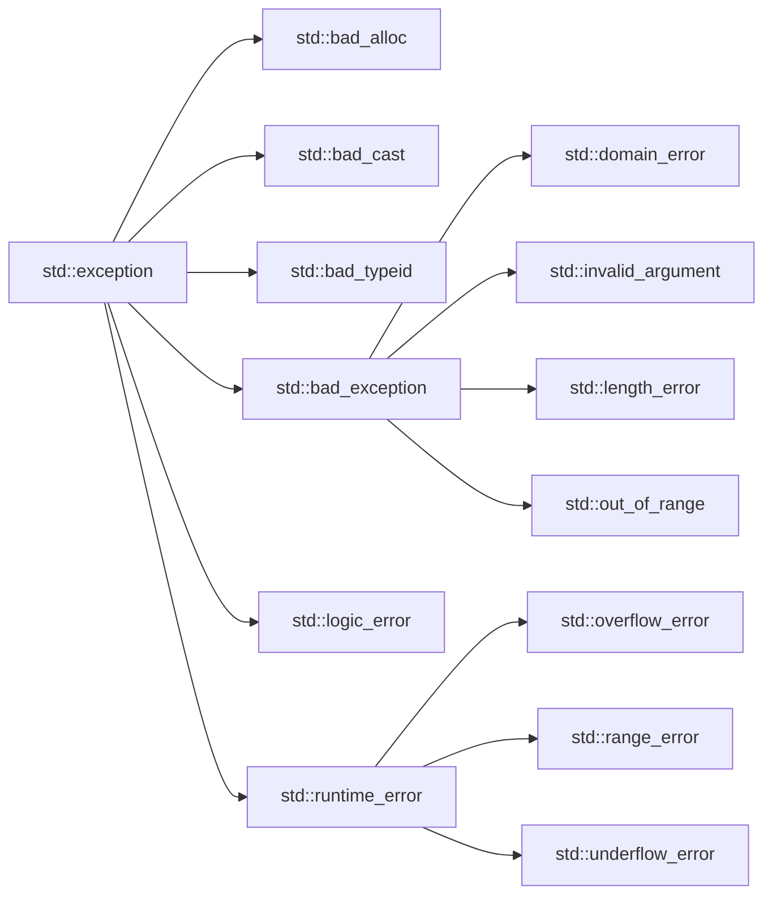

&emsp;&emsp;面向对象的语言处理错误几乎都选择了异常，与C语言使用错误码进行错误处理的方式不同。

# 一、C语言传统的错误处理方式

* 终止程序，通过 ``assert``，缺陷：直接终止程序，用户难以接受。
* 返回错误码，缺点是每次出错后我们都要自己去查询错误码表，比较麻烦。
* C标准库中的 ``setjmp``和 ``longjmp``处理，用的比较少。

# 二、C++的异常概念

&emsp;&emsp;异常是一种处理错误的方式，当一个函数发现自己无法处理出现的错误时就可以抛出异常，让函数的直接或间接调用者去处理这个错误。

* throw：当错误出现时，程序通过throw关键字来抛出一个异常。
* catch：在你想要处理问题的地方，通过异常处理程序捕获异常，通过catch关键字完成，可以有多个catch进行捕获。
* try：try块中的代码标识有可能被激活特定的异常，它后面通常跟着一个或多个catch块。

```cpp
double division(int a, int b)
{
	if (b == 0)
		throw "division by zero!";
	return (double)a / (double)b;
}

void func()
{
	int a, b;
	cin >> a >> b;
	cout << division(a, b) << endl;
}

int main()
{
	try
	{
		func();
	}
	// 通过catch来捕获指定类型的异常
	catch (const char* errmsg)
	{
		cout << errmsg << endl;
	}
	catch (...)
	{
		cout << "unknow error" << endl;
	}
	return 0;
}
```


&emsp;&emsp;通过单步调试可以发现，它的运行逻辑是一旦抛出异常后，不会继续顺序执行程序，而是会直接跳转到捕获异常的地方，

# 三、异常的使用

## 3.1 异常的抛出与捕获

异常的抛出和匹配原则：

1. 异常是**通过抛出对象而引发的**，**该对象的类型决定了应该激活哪个catch的处理代码**。
2. 被选中的处理代码是**调用链中与该对象类型匹配且离抛出异常位置最近的那一个**。
3. 抛出异常对象后，**会生成一个异常对象的拷贝**，因为抛出的异常对象可能是一个临时对象，所以会生成
   一个拷贝对象，这个拷贝的临时对象会在被catch以后销毁。（这里的处理类似于函数的传值返回）

   
4. catch(...)可以捕获任意类型的异常，**问题是不知道异常错误是什么**。
5. 实际中抛出和捕获的匹配原则有个例外，并不都是类型完全匹配，**可以抛出的派生类对象，使用基类捕获**，这个在实际中非常实用，我们后面会详细讲解这个。

在函数调用链中异常栈展开匹配原则：

1. 首先检查throw本身是否在try块内部，如果是再查找匹配的catch语句。如果有匹配的，则调到catch的地方进行处理。
2. **没有匹配的catch则退出当前函数栈，继续在调用函数的栈中进行查找匹配的catch**。
3. **如果到达main函数的栈，依旧没有匹配的，则终止程序**。上述这个沿着调用链查找匹配的catch子句的过程称为栈展开。**所以实际中我们最后都要加一个catch(...)捕获任意类型的异常，否则当有异常没捕获，程序就会直接终止**。

   
4. 找到匹配的catch子句并处理以后，**会继续沿着catch子句后面继续执行**。然后就相当于退出了已跳出的函数的栈帧。

&emsp;&emsp;在实际场景中，异常通常都是在最外层处理，而当程序非常庞大时，最外层可能要处理多种类型的异常，并且将发生的错误记录在日志中，这时就需要有一个异常规则去规定，否则最外层处理异常的人不可能处理的过来，那么怎么规范这个事情呢？这我们就可以用全面的派生类异常可以用基类捕获的特性了。

&emsp;&emsp;比如我们捕获类型 ``exception``的对象，我们可以抛它的派生类对象，然后甚至可以利用多态在同一个catch中完成异常的处理。

## 3.2 异常的重新抛出

&emsp;&emsp;有可能单个的catch不能完全处理一个异常，在进行一些校正处理以后，希望再交给更外层的调用链函数来处理，catch则可以通过重新抛出将异常传递给更上层的函数进行处理。这个技巧还是有一点价值的，比如我们下面这个有内存泄漏的程序，通过这个技巧可以在本层处理中处理掉内存泄漏问题，然后再次抛出异常，把报错信息往外层传：

```cpp
double division(int a, int b)
{
	if (b == 0)
	{
		string str("division by zero!");
		throw str;
	}

	return (double)a / (double)b;
}

void func()
{
	int* array = new int[10];
	try
	{
		int a, b;
		cin >> a >> b;
		cout << division(a, b) << endl;
	}
	catch (...)
	{
		// 第一次捕获 处理内存泄漏
		cout << "delete[] arr" << endl;
		delete[] array;
		// 再次抛出 给外层处理
		throw;
	}
	// ... other works
	cout << "delete[] arr" << endl;
	delete[] array;
}

int main()
{
	try
	{
		func();
	}
	catch (const string& str)
	{
		cout << str << endl;
	}
	return 0;
}
```


&emsp;&emsp;但其实这种情况我们经常用智能指针处理。

## 3.3异常安全

&emsp;&emsp;**构造函数完成对象的构造和初始化，最好不要在构造函数中抛出异常，否则可能导致对象不完整或没有完全初始化**;
&emsp;&emsp;**析构函数主要完成资源的清理，最好不要在析构函数内抛出异常，否则可能导致资源泄漏**(内存泄漏、句
柄未关闭等)
&emsp;&emsp;C++中异常经常会导致资源泄漏的问题，比如在new和delete中抛出了异常，导致内存泄漏，在lock和unlock之间抛出了异常导致死锁，C++经常使用RAII来解决以上问题，我们会在智能指针哪里讲解RAII。

## 3.4 异常规范

&emsp;&emsp;函数后面加上 ``throw(typeA, typeB, ...)``可以告诉函数使用者，我这个函数可能会抛出什么类型的异常，``throw()``表示我不会抛出异常。

&emsp;&emsp;但是这并不是一个强制的事情（因为要兼容C语言），异常规范虽然是很好的事情，但是在实际中异常规范很难执行。

&emsp;&emsp;在C++11中，增加了关键字 ``noexcept``，在函数声明末尾加上这个，告诉函数使用者这个函数不会抛出异常。

# 四、自定义异常体系

&emsp;&emsp;实际使用中很多公司都会自定义自己的异常体系进行规范的异常管理，因为一个项目中如果大家随意抛异常，那么外层的调用者基本就没办法玩了，所以实际中都会定义一套继承的规范体系。这样大家抛出的都是继承的派生类对象，捕获一个基类就可以了，具体处理异常可以利用多态机制，让父类调用某个虚函数就可以做到。

&emsp;&emsp;如我们下面随便给一个服务器开发中通常使用的异常体系：

```cpp
// 服务器开发中通常使用的异常继承体系
class Exception
{
public:
    Exception(const string& errmsg, int id) : _errmsg(errmsg), _id(id) {}
protected:
    string _errmsg;
    int _id;
    // ...
};
// 数据库错误
class SqlException : public Exception
{};
// 缓存层错误
class CacheException : public Exception
{};
// HTTP错误
class HttpServerException : public Exception
{};
int main()
{
 try{
    // server.Start();
    // 抛出对象都是派生类对象
 }
 catch (const Exception& e) // 这里捕获父类对象就可以
 {}
 catch (...)
 {
    cout << "Unkown Exception" << endl;
 }
     return 0;
}
```

&emsp;&emsp;我随便乱折腾了一下，以做练习：

```cpp
// 服务器开发中通常使用的异常继承体系
class Exception
{
public:
    Exception(const string& errmsg, int id) : _errmsg(errmsg), _id(id) {}
    string what() const
    {
        return _errmsg;
    }
protected:
    string _errmsg;
    int _id;
    // ...
};
// 数据库错误
class SqlException : public Exception
{};
// 缓存层错误
class CacheException : public Exception
{};
// HTTP错误
class HttpServerException : public Exception
{
public:
    HttpServerException(const string& errmsg, int id, int state)
        : Exception(errmsg, id), _state(state) {}
protected:
    int _state;
};

void sqlwork()
{
    // ... do something
}

void cachework()
{
    // ... do sth.
    sqlwork();
}

void httpwork()
{
    cachework();
    int p = rand();
    if (p % 3 == 0)
    {
        throw HttpServerException("权限不足", 1, 0);
    }
    else if (p % 7 == 0)
    {
        throw HttpServerException("网络连接错误", 2, 1);
    }
}

void Severstart()
{
    srand(unsigned int(time(nullptr)));
    while (1)
    {
        try
        {
            httpwork();
        }
        catch (const Exception& e) // 这里捕获父类对象就可以
        {
            cout << e.what() << endl;
        }
        catch (...)
        {
            cout << "Unkown Exception" << endl;
        }
    }
}

int main()
{
    Severstart();
    return 0;
}
```

&emsp;&emsp;再加了点多态进去，玩一下：

```cpp
// 服务器开发中通常使用的异常继承体系
class Exception
{
public:
    Exception(const string& errmsg, int id) : _errmsg(errmsg), _id(id) {}
    virtual string what() const
    {
        return _errmsg;
    }
protected:
    string _errmsg;
    int _id;
    // ...
};
// 数据库错误
class SqlException : public Exception
{
public:
    SqlException(const string& errmsg, int id) : Exception(errmsg, id) {}
    virtual string what() const override
    {
          return "数据库错误:" + _errmsg;
    }
};
// 缓存层错误
class CacheException : public Exception
{
public:
    CacheException(const string& errmsg, int id) : Exception(errmsg, id) {}
    virtual string what() const override
    {
        return "缓存层错误:" + _errmsg;
    }
};
// HTTP错误
class HttpServerException : public Exception
{
public:
    HttpServerException(const string& errmsg, int id, int state)
        : Exception(errmsg, id), _state(state) {}
    virtual string what() const override
    {
        return "HTTP层错误:" + _errmsg + ' ' + to_string(_id) + ' ' + to_string(_state);
    }
protected:
    int _state;
};

void sqlwork()
{
    int p = rand();
    if (p % 5 == 0)
    {
        throw SqlException("数据库插入错误!", 3);
    }
}

void cachework()
{
    // ... do sth.
    int p = rand();
    if (p % 7 == 0)
    {
        throw CacheException("缓存层空间不足!", 4);
    }
    sqlwork();
}

void httpwork()
{
    cachework();
    int p = rand();
    if (p % 3 == 0)
    {
        throw HttpServerException("权限不足", 1, 0);
    }
    else if (p % 7 == 0)
    {
        throw HttpServerException("网络连接错误", 2, 1);
    }
}

void Severstart()
{
    srand(unsigned int(time(nullptr)));
    while (1)
    {
        try
        {
            httpwork();
        }
        catch (const Exception& e) // 这里捕获父类对象就可以
        {
            cout << e.what() << endl;
        }
        catch (...)
        {
            cout << "Unkown Exception" << endl;
        }
        // system("sleep 1");
        Sleep(1000);
    }
}

int main()
{
    Severstart();
    return 0;
}
```


&emsp;&emsp;显然这套比错误码高到不知道哪里去了。

# 五、C++标准库的异常体系



| 异常                  | 描述                                                     |
| --------------------- | -------------------------------------------------------- |
| std::exception        | 该异常是所有C++标准库中的异常的父类                      |
| std::bad_alloc        | 该异常可以通过new抛出                                    |
| std::bad_cast         | 该异常可以通过dynamic_cast抛出                           |
| std::bad_exception    | 这在处理C++程序中预期之外的异常非常有用                  |
| std::bad_typeid       | 该异常可以通过typeid抛出                                 |
| std::logic_error      | 理论上可以通过读取代码检查出的逻辑错误                   |
| std::domain_error     | 当使用了一个无效的数学域时，会抛出该异常                 |
| std::invalid_argument | 当使用了无效的参数时，会抛出该异常                       |
| std::length_error     | 当创建了太长的std::string时，会抛出该异常                |
| std::out_of_range     | 超出下标范围时会抛出该异常，如vector和bitset的operator[] |
| std::runtime_error    | 理论上不可以通过阅读代码检查出的错误，属于运行时错误     |
| std::overflow_error   | 当发生数学上溢时，会抛出该异常                           |
| std::range_error      | 当尝试存储超出范围的值时，会抛出该异常                   |
| std::underflow_error  | 当发生数学下溢出时，会抛出该异常                         |

# 六、异常的优缺点

## 6.1 C++异常的优点

1. 异常对象定义好了，相比错误码的方式可以清晰准确的展示出错误的各种信息，甚至可以包含堆栈调用的信息，这样可以帮助更好的定位程序的bug。
2. 返回错误码的传统方式有个很大的问题就是，在函数调用链中，深层的函数返回了错误，那么我们得层层返回错误，最外层才能拿到错误，相对来讲比较困难麻烦。
3. 很多的第三方库都包含异常，比如boost、gtest、gmock等等常用的库，那么我们使用它们也需要使用异常。
4. 很多测试框架都使用异常，这样能更好的使用单元测试等进行白盒的测试。
5. 部分函数使用异常更好处理，比如构造函数没有返回值，不方便使用错误码方式处理。比如 ``T& operator[](size_t pos)``这样的函数，如果pos越界了只能使用异常或者终止程序处理，没办法通过返回值表示错误。

## 6.2 C++异常的缺点

1. 异常会导致程序的执行流乱跳，并且非常的混乱，并且是运行时出错抛异常就会乱跳。这会导致我们跟踪调试时以及分析程序时，比较困难，和我们很少使用goto是一个道理，这时，可能打断点就不会正常停下来，就出问题了。
2. 异常会有一些性能的开销。当然在现代硬件速度很快的情况下，这个影响基本忽略不计。
3. C++没有垃圾回收机制，资源需要自己管理。有了异常非常容易导致内存泄漏、死锁等异常安全问题。这个需要使用RAII来处理资源的管理问题。学习成本较高。
4. C++标准库的异常体系定义得不好，导致大家各自定义各自的异常体系，非常的混乱。
5. 异常尽量规范使用，否则后果不堪设想，随意抛异常，外层捕获的用户苦不堪言。所以异常规范有两点：一、抛出异常类型都继承自一个基类。二、函数是否抛异常、抛什么异常，都使用 异常规范func（）throw();的方式规范化。

总结：异常总体而言，利大于弊，所以工程中我们还是鼓励使用异常的。另外OO的语言基本都是用异常处理
错误，这也可以看出这是大势所趋。
